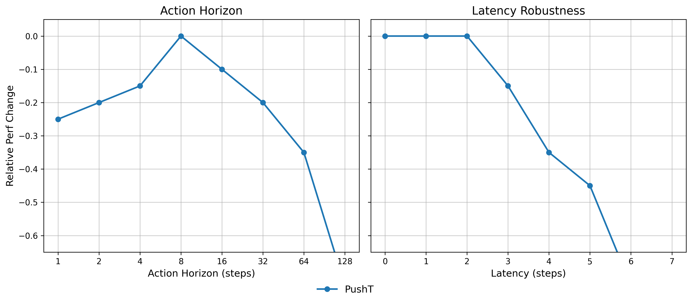
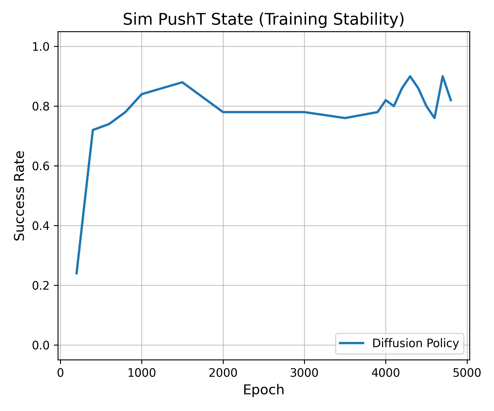

# State-Based Diffusion Policy for Under-Actuated Continuous Control


## Overview
This repository provides an independent, ground-up PyTorch implementation of the state-based **Diffusion Policy** architecture originally proposed by [Chi et al., 2023](https://diffusion-policy.cs.columbia.edu/). It is designed to solve the simulated **Push-T** task, an under-actuated point-contact continuous control problem.

The implementation explicitly avoids legacy/pre-packaged Behavior Cloning libraries and builds the Denoising Diffusion Probabilistic Model (DDPM), Conditional 1D U-Net, and Receding Horizon Control (RHC) logic from scratch.

## Key Architectural Features
*   **Conditional 1D U-Net:** Utilizes Feature-wise Linear Modulation (FiLM) to fuse timestep embeddings and an observation history ($O_t$) into the convolutional backbone.
*   **Receding Horizon Control (RHC):** Predicts a full action sequence ($T_p$) but executes a chunked action horizon ($T_a$) before replanning to mitigate compounding open-loop physical drift.
*   **Temporal Stability (EMA):** Implements an Exponential Moving Average ($\beta = 0.9999$) shadow model to smooth high-frequency gradient variance inherent to DDPM sampling.
*   **Sampling Bounds:** Enforces strict $[-1, 1]$ clamping on intermediate $x_0$ predictions during the 100-step reverse diffusion process to prevent multimodal trajectory collapse.
*   **Centralized Configuration:** All hyperparameter and architectural constraints are strictly decoupled via Dependency Injection (`config.py`).

## Benchmark Results (Sim PushT State)
The policy was trained locally for 4800 epochs on a consumer GPU (RTX 5080). Across 50 random environmental seeds, it achieved the following metrics, closely mirroring the original paper's baseline parity.

| Metric | Performance |
| :--- | :--- |
| **Max Performance** | `0.90` (90% Target Coverage) |
| **Asymptotic Average (Last 10 Checkpoints)** | `0.83` |

### Ablation Studies
Automated ablation suites evaluate the theoretical trade-offs between temporal consistency and environmental responsiveness.

<div align="center">
  
  <br>
  <em>Figure 1: (Left) Action Horizon (T<sub>a</sub>) vs. Relative Performance Change. Optimal consistency is found at T<sub>a</sub>=8. Open-loop execution (T<sub>a</sub>=128) results in catastrophic physical drift. (Right) Robustness to observation latency up to 2 steps.</em>
</div>

<br>

<div align="center">
  
  <br>
  <em>Figure 2: Validation success rate across 4800 epochs. The EMA shadow model prevents evaluation oscillation and mode collapse.</em>
</div>

## Installation & Setup

1. Clone the repository:
```bash
git clone https://github.com/Elemental-EL/PushT-Diffusion-Policy.git
cd Diffusion-Policy-PushT
```
2. Create the environment and install dependencies.

```Bash
conda create -n diffusion python=3.9
conda activate diffusion
pip install -r requirements.txt
```
3. Download the state [dataset (pusht_cchi_v7_replay.zarr)](https://diffusion-policy.cs.columbia.edu/data/training/pusht.zip) and place it in data/.

## Usage
1. Configuration

All network dimensions, receding horizon parameters ($T_p$, $T_a$, $O_h$), and training hyperparameters are centralized in `config.py`. Modify this file to scale the model.

2. Training

To train the DDPM and track the EMA weights:
```Bash
python train.py
```
3. Evaluation & RHC Inference

To evaluate the optimal checkpoint across multi-seed closed-loop rollouts and generate the trajectory plot:
```Bash
python eval.py
```
4. Run Ablation Suites

To reproduce the Action Horizon vs. Latency curve and the Training Stability benchmark (Table I / Fig 6 & 7):
```Bash
python ablation_fig6.py
python ablation_fig7_table1.py
```
## References
Chi, C., Feng, S., Du, Y., Xu, Z., Cousineau, E., Burchfiel, B., & Song, S. (2023). [Diffusion Policy: Visuomotor Policy Learning via Action Diffusion](https://arxiv.org/pdf/2303.04137v4). Robotics: Science and Systems (RSS).
